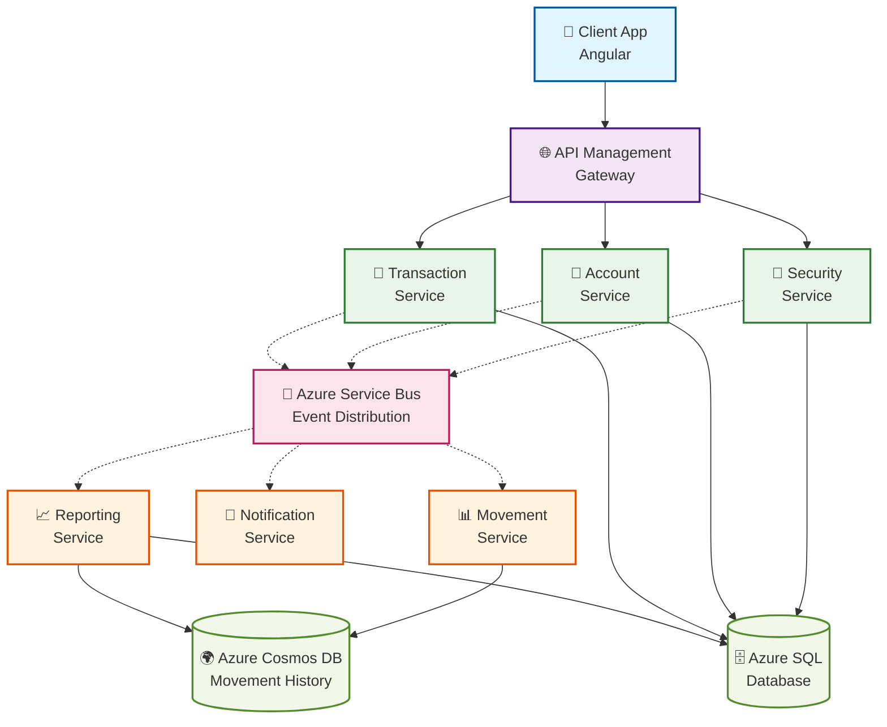

# Bank System Microservices

<!-- Sonar Qube Badges -->
<table>
  <tr>
    <td><a href="https://sonarcloud.io/summary/new_code?id=cristofima_BankSystemMicroservices"></a></td>
    <td><a href="https://sonarcloud.io/summary/new_code?id=cristofima_BankSystemMicroservices"></a></td>
    <td><a href="https://sonarcloud.io/summary/new_code?id=cristofima_BankSystemMicroservices"></a></td>
    <td><a href="https://sonarcloud.io/summary/new_code?id=cristofima_BankSystemMicroservices"></a></td>
    <td><a href="https://sonarcloud.io/summary/new_code?id=cristofima_BankSystemMicroservices"></a></td>
  </tr>
  <tr>
    <td><a href="https://sonarcloud.io/summary/new_code?id=cristofima_BankSystemMicroservices"></a></td>
    <td><a href="https://sonarcloud.io/summary/new_code?id=cristofima_BankSystemMicroservices"></a></td>
    <td><a href="https://sonarcloud.io/summary/new_code?id=cristofima_BankSystemMicroservices"></a></td>
    <td><a href="https://sonarcloud.io/summary/new_code?id=cristofima_BankSystemMicroservices"></a></td>
    <td><a href="https://sonarcloud.io/summary/new_code?id=cristofima_BankSystemMicroservices"></a></td>
    <td><a href="https://sonarcloud.io/summary/new_code?id=cristofima_BankSystemMicroservices"></a></td>
  </tr>
</table>

A modern, cloud-native banking system built with .NET 9 microservices architecture, designed for Azure deployment with Clean Architecture, CQRS, and Event-Driven Architecture patterns.

## 🏗️ Architecture Overview

This system implements a distributed banking platform using microservices that communicate through Azure Service Bus events, following Domain-Driven Design (DDD) principles and the CQRS pattern for optimal scalability and maintainability.

### Core Microservices

- **🔐 Security Service**: Handles authentication, authorization, and user management
- **🏦 Account Service**: Manages customer accounts, balances, and account operations
- **💸 Transaction Service**: Processes financial transactions (deposits, withdrawals) - Write operations
- **📊 Movement Service**: Provides transaction history and reporting - Read operations
- **🔔 Notification Service**: Manages multi-channel notifications and alerts
- **📈 Reporting Service**: Handles analytics, reports, and business intelligence

### Architecture Patterns

- **Clean Architecture**: Clear separation of concerns across layers
- **CQRS (Command Query Responsibility Segregation)**: Separate read and write operations
- **Event-Driven Architecture**: Asynchronous communication via Azure Service Bus
- **Domain-Driven Design**: Rich domain models with business logic encapsulation
- **Microservices**: Independently deployable and scalable services

## 🚀 Technology Stack

### Backend

- **.NET 9**: Latest framework with improved performance and features
- **ASP.NET Core**: Web API framework
- **Entity Framework Core**: ORM for data access
- **MediatR**: CQRS and Mediator pattern implementation
- **FluentValidation**: Input validation
- **AutoMapper**: Object-to-object mapping
- **Serilog**: Structured logging

### Azure Services

- **Azure Service Bus**: Message broker for event-driven communication
- **Azure SQL Database**: Primary database for transactions and accounts
- **Azure Cosmos DB**: Document database for movement history (read-optimized)
- **Azure Key Vault**: Secrets and configuration management
- **Azure Application Insights**: Monitoring and telemetry
- **Azure API Management**: API Gateway and management
- **Azure Container Apps**: Container hosting platform

### Development Tools

- **Docker**: Containerization
- **.NET Aspire**: Local development orchestration and monitoring _(Local Development Only)_
- **YARP**: Reverse proxy for API Gateway _(Local Development Only)_
- **Terraform/Bicep**: Infrastructure as Code
- **Azure DevOps**: CI/CD pipelines
- **xUnit**: Unit testing framework
- **FluentAssertions**: Assertion library

### Environment Architecture

#### Local Development Environment

- **API Gateway**: YARP-based reverse proxy for service routing
- **.NET Aspire Dashboard**: Local orchestration and monitoring
- **ServiceDefaults**: Aspire-based service configuration and telemetry

#### Production Environment (Azure)

- **Azure API Management**: Replaces local API Gateway for enterprise-grade routing, policies, and security
- **Azure Application Insights Dashboard**: Replaces .NET Aspire Dashboard for production monitoring
- **Azure Service Discovery**: Native Azure service discovery and load balancing

## 🏛️ System Architecture



## 🔄 Event-Driven Flow

### Transaction Processing Flow

1. **Client** initiates a deposit/withdrawal request
2. **API Gateway** routes to Transaction Service
3. **Transaction Service** validates and processes the transaction
4. **Transaction Service** publishes `TransactionCreatedEvent`
5. **Account Service** subscribes to update account balance
6. **Movement Service** subscribes to create movement history record

### Benefits

- **Loose Coupling**: Services communicate through events
- **Scalability**: Each service can scale independently
- **Resilience**: Failure in one service doesn't affect others
- **Eventual Consistency**: Data consistency across services

## 📁 Project Structure

```
BankSystemMicroservices/
├── 📄 README.md                                  # Main documentation
├── 📄 LICENSE                                    # MIT License
├── 📄 docker-compose.yml                         # Docker orchestration
├── 📄 docker-compose.infrastructure.yml          # Infrastructure services
├── 📂 src/                                       # Source code
│   ├── 📄 BankSystem.sln                        # Main solution file
│   ├── 📄 coverlet.runsettings                  # Test coverage settings
│   ├── 📂 aspire-app/                           # 🏠 LOCAL DEVELOPMENT ONLY
│   │   ├── 📂 AppHost/                          # .NET Aspire orchestration
│   │   │   ├── 📄 AppHost.cs                    # Aspire host configuration
│   │   │   ├── 📄 BankSystem.AppHost.csproj     # AppHost project file
│   │   │   └── 📄 appsettings.json              # Aspire settings
│   │   └── 📂 ServiceDefaults/                  # Aspire service defaults
│   │       ├── 📄 Extensions.cs                 # Service extensions
│   │       └── 📄 BankSystem.ServiceDefaults.csproj
│   ├── 📂 gateway/                              # 🌐 LOCAL DEVELOPMENT ONLY
│   │   └── 📂 ApiGateway/                       # YARP-based API Gateway
│   │       ├── 📄 Program.cs                    # Gateway entry point
│   │       ├── 📄 BankSystem.ApiGateway.csproj  # Gateway project
│   │       └── 📄 appsettings.json              # Gateway configuration
│   ├── 📂 services/                             # 🏗️ Microservices
│   │   ├── 📂 Security/                         # 🔐 Authentication & Authorization
│   │   │   ├── 📂 src/
│   │   │   │   ├── 📂 Security.Api/             # Web API layer
│   │   │   │   ├── 📂 Security.Application/     # Application layer (CQRS)
│   │   │   │   ├── 📂 Security.Domain/          # Domain layer (DDD)
│   │   │   │   └── 📂 Security.Infrastructure/  # Infrastructure layer
│   │   │   └── 📂 tests/                        # Service-specific tests
│   │   │       ├── 📂 Security.Application.UnitTests/
│   │   │       ├── 📂 Security.Domain.UnitTests/
│   │   │       └── 📂 Security.Infrastructure.IntegrationTests/
│   │   ├── 📂 Account/                          # 🏦 Account Management
│   │   │   ├── 📂 src/                          # Same structure as Security
│   │   │   └── 📂 tests/                        # Same test structure
│   │   ├── 📂 Transaction/                      # 💸 Transaction Processing (Write)
│   │   │   ├── 📂 src/                          # Same structure as Security
│   │   │   └── 📂 tests/                        # Same test structure
│   │   ├── 📂 Movement/                         # 📊 Movement History (Read)
│   │   │   ├── 📂 src/                          # Same structure as Security
│   │   │   └── 📂 tests/                        # Same test structure
│   │   ├── 📂 Notification/                     # 🔔 Notifications
│   │   │   ├── 📂 src/                          # Same structure as Security
│   │   │   └── 📂 tests/                        # Same test structure
│   │   └── 📂 Reporting/                        # 📈 Reporting & Analytics
│   │       ├── 📂 src/                          # Same structure as Security
│   │       └── 📂 tests/                        # Same test structure
│   └── 📂 shared/                               # 🔗 Shared Components
│       ├── 📂 src/
│       │   ├── 📂 BankSystem.Shared.Domain/     # Common domain logic
│       │   ├── 📂 BankSystem.Shared.Infrastructure/ # Common infrastructure
│       │   └── 📂 BankSystem.Shared.WebApi/     # Web API configurations
│       └── 📂 tests/
│           └── 📂 BankSystem.Shared.Domain.UnitTests/
├── 📂 docs/                                     # 📚 Documentation
│   ├── 📄 dotnet-development-guidelines.md      # Development guidelines
│   ├── 📄 health-checks-configuration.md        # Health checks guide
│   ├── 📄 sonarqube-integration-guide.md        # SonarQube setup
│   └── 📂 guidelines/                           # Detailed guidelines
│       ├── 📄 clean-code.md                     # Clean code practices
│       ├── 📄 api-design.md                     # API design patterns
│       ├── 📄 cqrs-implementation.md            # CQRS patterns
│       └── 📄 ...                               # Other guidelines
├── 📂 scripts/                                  # 🔧 Build & Deployment Scripts
│   ├── 📄 build-local.bat                       # Windows build script
│   ├── 📄 build-local.ps1                       # PowerShell build script
│   ├── 📄 run-unit-tests.ps1                    # Test execution script
│   └── 📄 BUILD_SCRIPTS.md                      # Scripts documentation
├── 📂 tests/                                    # 🧪 Cross-Service Integration Tests
│   └── 📂 integration/                          # End-to-end test scenarios
└── 📂 build/                                    # 🚀 CI/CD Configurations
    ├── 📂 azure-pipelines/                      # Azure DevOps pipelines
    │   └── 📄 ci-build-test.yml                 # CI/CD pipeline definition
    └── 📂 terraform/                            # Infrastructure as Code
        ├── 📄 main.tf                           # Main Terraform config
        └── 📄 variables.tf                      # Terraform variables
```

### Local vs Production Components

- **aspire-app/** and **gateway/**: Used only for local development
- **Production**: Azure API Management and Azure Application Insights replace these components

## 🚦 Getting Started

### Prerequisites

- .NET 9 SDK
- Docker Desktop
- Azure CLI
- Visual Studio 2022 or VS Code

### Local Development Setup

1. **Clone the repository**

   ```bash
   git clone https://github.com/your-org/bank-system-microservices.git
   cd bank-system-microservices
   ```

2. **Start infrastructure services**

   ```bash
   docker-compose -f docker-compose.infrastructure.yml up -d
   ```

3. **Update connection strings**

   ```bash
   # Update appsettings.Development.json in each service
   ```

4. **Run database migrations**

   ```bash
   dotnet ef database update --project src/services/Account/src/Account.Infrastructure
   dotnet ef database update --project src/services/Transaction/src/Transaction.Infrastructure
   ```

5. **Start services**

   ```bash
   # Terminal 1 - Security Service
   dotnet run --project src/services/Security/src/Security.Api

   # Terminal 2 - Account Service
   dotnet run --project src/services/Account/src/Account.Api

   # Terminal 3 - Transaction Service
   dotnet run --project src/services/Transaction/src/Transaction.Api

   # Terminal 4 - Movement Service
   dotnet run --project src/services/Movement/src/Movement.Api

   # Terminal 5 - Notification Service
   dotnet run --project src/services/Notification/src/Notification.Api

   # Terminal 6 - Reporting Service
   dotnet run --project src/services/Reporting/src/Reporting.Api
   ```

## 🔧 Configuration

### Environment Variables

```bash
# Database Connections
CONNECTIONSTRINGS__DEFAULTCONNECTION="Server=localhost;Database=BankSystem;Trusted_Connection=true;"

# Azure Service Bus
AZURE__SERVICEBUS__CONNECTIONSTRING="Endpoint=sb://your-namespace.servicebus.windows.net/..."

# JWT Settings
JWT__KEY="your-super-secret-key"
JWT__ISSUER="https://localhost:5001"
JWT__AUDIENCE="bank-system-api"
```

## 📊 API Documentation

Each microservice exposes its own OpenAPI/Scalar documentation:

- **Security API**: `https://localhost:5001/scalar`
- **Account API**: `https://localhost:5002/scalar`
- **Transaction API**: `https://localhost:5003/scalar`
- **Movement API**: `https://localhost:5004/scalar`
- **Notification API**: `https://localhost:5005/scalar`
- **Reporting API**: `https://localhost:5006/scalar`

## 🧪 Testing

### Run Unit Tests

**Basic unit test execution:**

```bash
dotnet test
```

**Run unit tests with code coverage (recommended):**

```powershell
# Use the provided PowerShell script
./scripts/run-unit-tests.ps1
```

This will:

- Run all unit test projects in the solution
- Generate code coverage reports in multiple formats (HTML, Cobertura, JSON)
- Open the HTML coverage report automatically
- Results are saved to `TestResults/` directory

**Manual coverage command:**

```bash
dotnet test --configuration Debug --collect:"XPlat Code Coverage" --settings coverlet.runsettings --results-directory TestResults /p:CollectCoverage=true /p:CoverletOutputFormat=cobertura /p:CoverletOutput=TestResults/coverage.cobertura.xml
```

### Run Integration Tests

```bash
dotnet test --configuration Release --filter Category=Integration
```

### Run Load Tests

```bash
# Using k6 or Azure Load Testing
k6 run tests/load/transaction-load-test.js
```

### Available Test Scripts

See [scripts/README.md](scripts/README.md) for detailed information about available build and test scripts.

## 🚀 Deployment

### Azure Deployment

```bash
# Deploy infrastructure
terraform apply -var-file="environments/prod.tfvars"

# Deploy applications
az acr build --registry bankSystemRegistry --image security-service:latest ./src/services/Security
az containerapp update --name security-service --image bankSystemRegistry.azurecr.io/security-service:latest
```

## 🔍 Monitoring & Observability

- **Application Insights**: Performance monitoring and telemetry
- **Azure Monitor**: Infrastructure monitoring
- **Structured Logging**: Centralized logging with Serilog
- **Health Checks**: Service health monitoring
- **Distributed Tracing**: Request flow tracking

## 🤝 Contributing

1. Fork the repository
2. Create a feature branch (`git checkout -b feature/amazing-feature`)
3. Follow the [Development Guidelines](docs/dotnet-development-guidelines.md)
4. Commit your changes (`git commit -m 'Add amazing feature'`)
5. Push to the branch (`git push origin feature/amazing-feature`)
6. Open a Pull Request

## 📚 Documentation

- [.NET Development Guidelines](docs/dotnet-development-guidelines.md)
- [API Documentation](docs/api-documentation.md)
- [Architecture Decision Records](docs/adr/)
- [Deployment Guide](docs/deployment-guide.md)

## 📄 License

This project is licensed under the MIT License - see the [LICENSE](LICENSE) file for details.

## 🔗 Related Services

- [Security Service](src/services/Security/README.md)
- [Account Service](src/services/Account/README.md)
- [Transaction Service](src/services/Transaction/README.md)
- [Movement Service](src/services/Movement/README.md)
- [Notification Service](src/services/Notification/README.md)
- [Reporting Service](src/services/Reporting/README.md)
